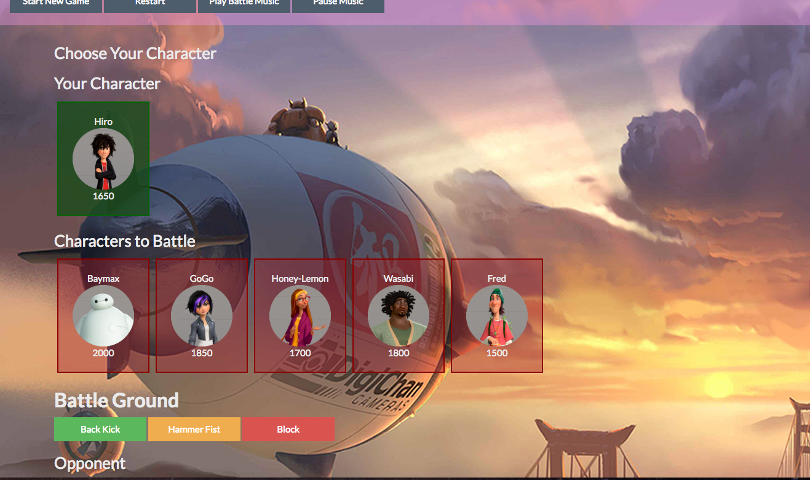
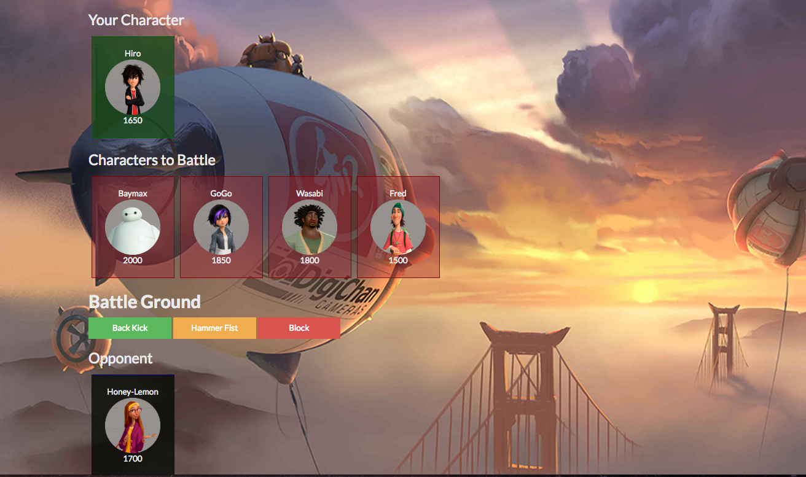

## Big Hero 6: RPG

https://devcenter.heroku.com/articles/rails-asset-pipeline

Big Hero 6 themed RPG game. The user can choose their favorite character from the cast of Big Hero 6 and has to battle all the other characters to win the game. I added an option to play 'Battle Music' (Fall Out Boy - Immortals) whilst playing the game.

## Motivation

Created during Week 4 of Rutgers Coding Bootcamp. The challenge was to create a Star Wars RPG Game, but I added a twist with one of my favorite Disney films.

## Getting Started 
http://big-hero-6-rpg.herokuapp.com/

## Screenshots


After Pressing 'Start Game' button


When you select your character, it moves the other characters into 'Characters to Battle'


Places selected opponent into the 'Battleground'

## Technologies used
- Bootswatch
- jQuery

### Prerequisites

```
- Bootswatch: visit and download https://bootswatch.com/superhero/ - link in html
- jQuery: visit http://code.jquery.com/ and link in html
```

## Built With

* Sublime Text - Text Editor
* Bootswatch- Wireframe

## Authors

* **Stefanie Ding** - *HTML/CSS/JS* - [Stefanie Ding](https://github.com/StefanieDing)

## Acknowledgments

* Thanks to Dan, Nate, and Jimmy from Rutgers Coding Bootcamp for additional help.